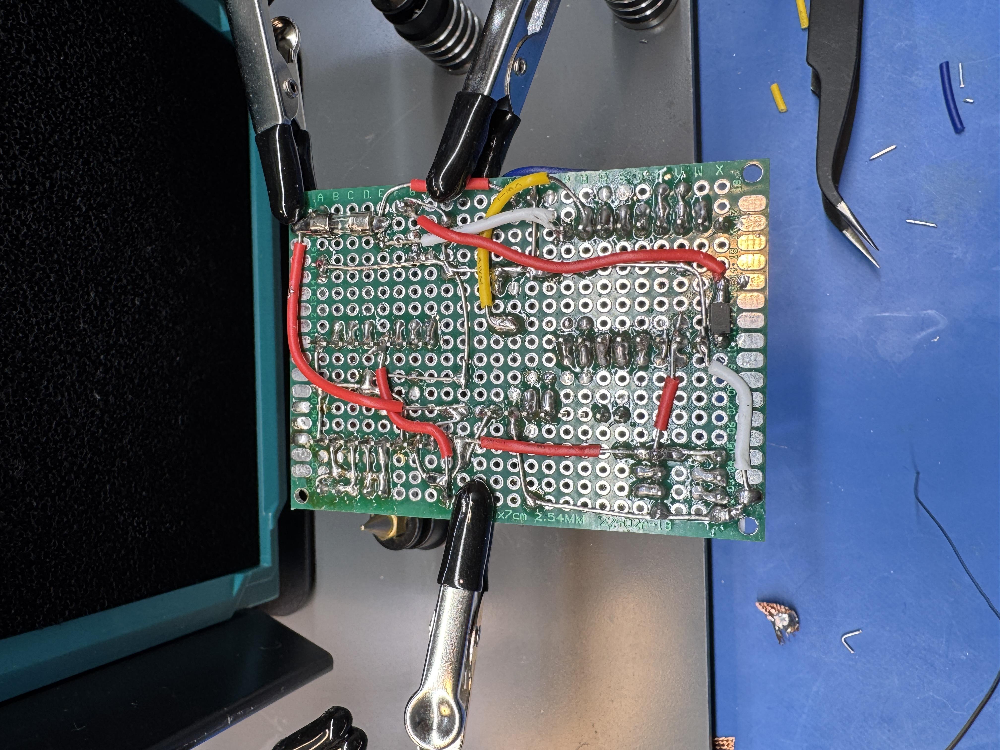
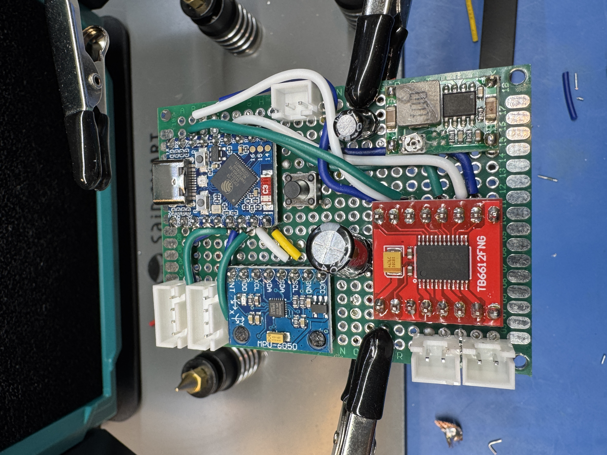

# SBRB -- Another Arduino-based Self-Balancing Robot

## Overview

Well, is it really Arduino based? A little bit, but it's a funky
hybrid of ESP-IDF and Arduino code. This bot can be controlled
using a BLE gamepad like the Steam Controller (BLE firmware).

## Features

- Remote controllable
- Self-balancing
- Telemetry and bluetooth-based tuning
- Battery monitoring (assumes 2S LiPo, see schematics for voltage divider
  requirements)

## Schematics

There is a sort-of-working KiCad schematic in the `kicad` directory.
This is not actually what I used: I soldered together a protoboard.
Also, the pin configuration on the proto board and in the code is
significantly altered from what is shown in the schematic.

## Building

The bot uses 3D printed parts from this [OnShape document](https://cad.onshape.com/documents/8def695b0fbd504a5c261cca/w/9027d04ea9ab3dbc2eeb5165/e/62757f7892dd92c4c3207e76?renderMode=0&uiState=6980eee3efbda49a56e499ec).

## BOM

In addition to the 3D printed parts, you need:

* 2x 693ZZ bearings.
* 2x 500 RPM N20 motors with gearboxes (I used [these](https://www.aliexpress.us/item/3256807135186419.html?spm=a2g0o.order_list.order_list_main.5.16f118023HkDq9&gatewayAdapt=glo2usa))
* 1x 50x70mm perfboard
* 1x MPU-6050
* 1x ESP32-S3 Zero Dev board
* 1x Mini360 buck converter
* 1x 20k resistor (buy a 0508 assortment of SMD parts, should have the caps and diode too)
* 1x 10k resistor
* 2x 100nF capacitor SMD 
* 1x 470uF capacitor throughhole (buy an assortment)
* 1x 100uF capacitor throughhole
* 1x 1N5819 Schottky diode
* 1x 3A fuse (you can use less, 2A would be fine)
* 1x throughhole power switch capable of supporting same amperage as your
  fuse
* 1x TB6612FNG motor driver breakout board
* 1x 2S LiPo battery
* 3x JST-XH 2 pin through hole header
* 2x JST-XH 4 pin through hole header
* JST-XH female connectors for wires

## Media

